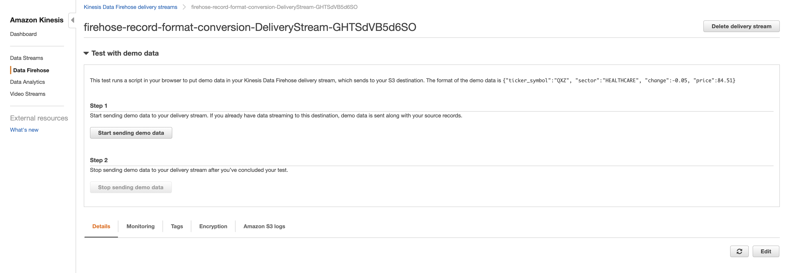
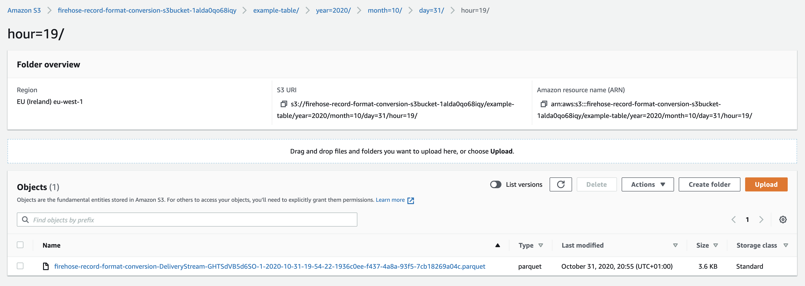

# Firehose record format conversion

This project demonstrates the use of AWS Kinesis Firehose to convert a JSON records to Parquet format.
The data is landed on S3. 

In `template.yaml` you will find the necessary cloudformation.

## Instructions

* Deploy the stack

```
aws cloudformation deploy --template-file template.yaml --stack-name firehose-record-format-conversion --capabilities CAPABILITY_IAM --region eu-west-1
```

* In the output of the stack locate the Firehose name and S3Bucket name
* Login to the AWS console and navigate to the service Kinesis
* Locate your firehose (this will be under "Delivery Stream", "Data Firehose") and open the details of your firehose.
* Hit test with demo data

Notice that the demo data AWS sends maps to the schema we configured in cloudformation for our record conversion.
* In the AWS console go to your S3 Bucket
* After about a minute data will appear here.
* Find the data! Partitions are following hive format!

* The data has been converted to parquet format!  
:sunglasses: